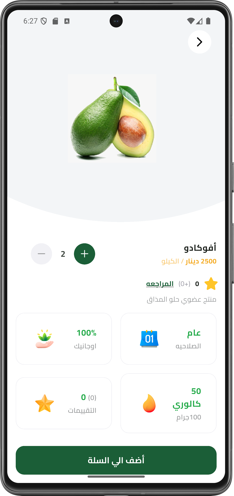
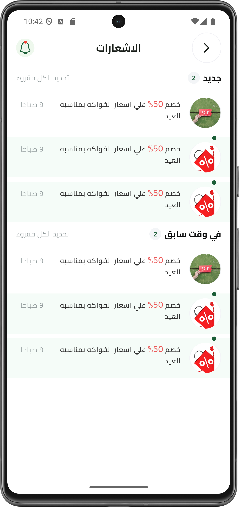

# ThimarHub Fruit Ecommerce Mobile App

 

## 📝 Description

ThimarHub-Fruit-Ecommerce is a vibrant and user-friendly mobile application designed to simplify the process of buying fresh produce. Developed using the Flutter framework and integrated with Firebase, this e-commerce platform provides a seamless and secure shopping experience. Key highlights include a robust authentication system for user security and a well-tested codebase to ensure reliability and performance. Whether you are looking for seasonal fruits or daily essentials, ThimarHub offers a modern solution for healthy living on the go.


## Screenshots

|                         Splash                          | Onboarding | Second Onboarding | Login |
|:-------------------------------------------------------:|:----------:|:----------------:|:-----:|
|  |  |  |  |

|                    Change Password 1                    |                       Change Password 2                       |                       Change Password 3                       |                       Change Password 4                       |
|:-------------------------------------------------------:|:-------------------------------------------------------------:|:-------------------------------------------------------------:|:-------------------------------------------------------------:|
|  |  |  |  |


|                       Product Details View                       |                                                            Review  View                                                            |                                                            Notification  View                                                            |
|:----------------------------------------------------------------:|:----------------------------------------------------------------------------------------------------------------------------------:|:----------------------------------------------------------------------------------------------------------------------------------:|
|  |                                                                             |                                                                             |


| Sign Up | Main | Products | Filter |
|:-------:|:----:|:--------:|:------:|
|  |  |  |  |

| Second Filter | Cart | My Orders | My Purchases |
|:-------------:|:----:|:---------:|:------------:|
|  |  |  |  |

| Personal Account | Edit Personal Info | About Us | Shipping Info |
|:----------------:|:-----------------:|:--------:|:-------------:|
|  |  |  |  |

| Payment Method | Payment Card | Add New Card | Payment Ticket |
|:--------------:|:-----------:|:------------:|:--------------:|
|  |  |  |  |

| PayPal | PayPal Second |
|:------:|:-------------:|
|  |  |

## ✨ Features

- 🔐 Auth
- 🧪 Testing
- Orders
- Profile 
- Cart
- Home
- Checkout


## 🛠️ Tech Stack

- 💙 Flutter


## 📦 Key Dependencies

```
name: ecommerce_app
description: "A new Flutter project."
publish_to: 'none' # Remove this line if you wish to publish to pub.dev
version: 1.0.0+1
sdk: flutter
cupertino_icons: ^1.0.8
flutter_launcher_icons: ^0.14.4
flutter_svg: ^2.2.0
intl: ^0.20.2
dots_indicator: ^4.0.1
shared_preferences: ^2.5.3
dartz: ^0.10.1
flutter_bloc: ^9.1.1
get_it: ^9.0.5
modal_progress_hud_nsn: ^0.5.1
```

## 📁 Project Structure

```
.
├── LICENSE
├── analysis_options.yaml
├── assets
│   ├── fonts
│   │   ├── Cairo-Bold.ttf
│   │   ├── Cairo-Medium.ttf
│   │   ├── Cairo-Regular.ttf
│   │   └── Cairo-SemiBold.ttf
│   ├── images
│   │   ├── accept_order.png
│   │   ├── apple_icon.svg
│   │   ├── check_icon.svg
│   │   ├── circles_splash.svg
│   │   ├── facebook_icon.svg
│   │   ├── false_icon.svg
│   │   ├── featured_image_1.png
│   │   ├── google_icon.svg
│   │   ├── icon
│   │   │   └── starting_logo.png
│   │   ├── logo_splash.png
│   │   ├── notification_come_icon.svg
│   │   ├── on_boarding_background_image1.svg
│   │   ├── on_boarding_background_image2.svg
│   │   ├── on_boarding_image1.svg
│   │   ├── on_boarding_image2.svg
│   │   ├── order_arrive.png
│   │   ├── order_exit.png
│   │   ├── order_number.png
│   │   ├── payments
│   │   │   ├── apple_pay.png
│   │   │   ├── mastercard.png
│   │   │   ├── paypal.png
│   │   │   └── visa.png
│   │   ├── plant.svg
│   │   ├── product_details_circle.svg
│   │   ├── products
│   │   │   ├── ananas.png
│   │   │   ├── avocado.png
│   │   │   ├── bananas.png
│   │   │   ├── mango.png
│   │   │   ├── strawberry.png
│   │   │   └── watermelon.png
│   │   ├── products_details
│   │   │   ├── calendar.png
│   │   │   ├── favourites.png
│   │   │   ├── lotus.png
│   │   │   └── matches 1.png
│   │   ├── profile_image.png
│   │   ├── profile_image_view.png
│   │   ├── shipping_order.png
│   │   ├── strawberry.png
│   │   ├── success_image.png
│   │   ├── track_order.png
│   │   └── true_circle_container.svg
│   └── preview
│       ├── about_us_view.png
│       ├── add_new_payment_card_view.png
│       ├── carts_view.png
│       ├── change_password_1.png
│       ├── change_password_2.png
│       ├── change_password_3.png
│       ├── change_password_4.png
│       ├── edit_personal_information_view.png
│       ├── filter_view.png
│       ├── login_view.png
│       ├── main_view.png
│       ├── my_orders_view.png
│       ├── my_purchases.png
│       ├── on_boarding_view.png
│       ├── payment_card_view.png
│       ├── payment_method_view.png
│       ├── payment_ticket_view.png
│       ├── paypal_view.png
│       ├── paypal_view_second.png
│       ├── personal_account_view.png
│       ├── products_view.png
│       ├── second_filter_view.png
│       ├── second_on_boarding_view.png
│       ├── shipping_information.png
│       ├── sign_up_view.png
│       └── splash_view.png
├── devtools_options.yaml
├── firebase.json
├── lib
│   ├── constants.dart
│   ├── core
│   │   ├── cubits
│   │   │   └── products_cubit
│   │   │       ├── products_cubit.dart
│   │   │       └── products_state.dart
│   │   ├── entities
│   │   │   ├── bottom_nav_bar_entity.dart
│   │   │   ├── product_entity.dart
│   │   │   └── review_entity.dart
│   │   ├── enums
│   │   │   └── order_status_enum.dart
│   │   ├── errors
│   │   │   ├── custom_exceptions.dart
│   │   │   └── failures.dart
│   │   ├── helper
│   │   │   ├── build_app_bar.dart
│   │   │   ├── get_avg_rating.dart
│   │   │   ├── get_currency.dart
│   │   │   ├── get_dummy_products.dart
│   │   │   ├── get_user.dart
│   │   │   ├── on_generate_routes.dart
│   │   │   ├── show_false_snack_bar.dart
│   │   │   ├── show_snack_bar.dart
│   │   │   └── show_true_snack_bar.dart
│   │   ├── models
│   │   │   ├── list_tile_model.dart
│   │   │   ├── our_products_row_model.dart
│   │   │   ├── product_model.dart
│   │   │   └── review_model.dart
│   │   ├── repos
│   │   │   ├── orders_repo
│   │   │   │   ├── order_repo.dart
│   │   │   │   └── order_repo_impl.dart
│   │   │   └── products_repo
│   │   │       ├── products_repo.dart
│   │   │       └── products_repo_impl.dart
│   │   ├── services
│   │   │   ├── custom_bloc_observer.dart
│   │   │   ├── database_service.dart
│   │   │   ├── firebase_auth_service.dart
│   │   │   ├── firestore_service.dart
│   │   │   ├── service_locator.dart
│   │   │   └── shared_preferences_singleton.dart
│   │   ├── utils
│   │   │   ├── assets.dart
│   │   │   ├── backend_breakpoint.dart
│   │   │   ├── colors.dart
│   │   │   └── styles.dart
│   │   └── widgets
│   │       ├── active_bottom_nav_bar_item.dart
│   │       ├── add_and_minus_number.dart
│   │       ├── app_bar_with_back_arrow.dart
│   │       ├── bottom_nav_bar_item.dart
│   │       ├── bottom_navigation_bar_body.dart
│   │       ├── bottom_sheet_line_header.dart
│   │       ├── circle_check_box.dart
│   │       ├── custom_app_bar.dart
│   │       ├── custom_bottom_navigation_bar.dart
│   │       ├── custom_button.dart
│   │       ├── custom_error_widget.dart
│   │       ├── custom_image_network.dart
│   │       ├── custom_search_bar.dart
│   │       ├── custom_small_oval_container.dart
│   │       ├── custom_text_form_field.dart
│   │       ├── fruit_item.dart
│   │       ├── go_back_circle.dart
│   │       ├── inactive_bottom_nav_bar_item.dart
│   │       ├── notification_container.dart
│   │       ├── price_container.dart
│   │       ├── price_dynamic_range.dart
│   │       ├── row_price.dart
│   │       └── toggle_container_switch.dart
│   ├── features
│   │   ├── auth
│   │   │   ├── data
│   │   │   │   ├── models
│   │   │   │   │   └── user_model.dart
│   │   │   │   └── repos
│   │   │   │       └── auth_repo_impl.dart
│   │   │   ├── domain
│   │   │   │   ├── entities
│   │   │   │   │   └── user_entity.dart
│   │   │   │   └── repos
│   │   │   │       └── auth_repo.dart
│   │   │   └── presentation
│   │   │       ├── manager
│   │   │       │   └── cubits
│   │   │       │       ├── log_in_cubit
│   │   │       │       │   ├── login_cubit.dart
│   │   │       │       │   └── login_state.dart
│   │   │       │       └── sign_up_cubit
│   │   │       │           ├── sign_up_cubit.dart
│   │   │       │           └── sign_up_state.dart
│   │   │       └── views
│   │   │           ├── code_verification_view.dart
│   │   │           ├── forget_password_view.dart
│   │   │           ├── login_view.dart
│   │   │           ├── new_password_view.dart
│   │   │           ├── signup_view.dart
│   │   │           └── widgets
│   │   │               ├── ask_user_auth.dart
│   │   │               ├── bloc_consumer_login_view_body.dart
│   │   │               ├── bloc_consumer_sign_up_view_body.dart
│   │   │               ├── code_verification_view_body.dart
│   │   │               ├── custom_check_box.dart
│   │   │               ├── custom_loading_indicator.dart
│   │   │               ├── custom_social_media_button.dart
│   │   │               ├── forget_password_view_body.dart
│   │   │               ├── login_view_body.dart
│   │   │               ├── new_password_view_body.dart
│   │   │               ├── or_divider.dart
│   │   │               ├── otp_fields.dart
│   │   │               ├── password_field.dart
│   │   │               ├── signup_view_body.dart
│   │   │               └── terms_and_conditions.dart
│   │   ├── best_selling
│   │   │   └── presentation
│   │   │       └── views
│   │   │           ├── best_selling_view.dart
│   │   │           └── widgets
│   │   │               └── best_selling_view_body.dart
│   │   ├── cart
│   │   │   ├── domain
│   │   │   │   └── entities
│   │   │   │       ├── cart_entity.dart
│   │   │   │       └── cart_item_entity.dart
│   │   │   └── presentation
│   │   │       ├── manager
│   │   │       │   └── cubits
│   │   │       │       ├── cart_cubit
│   │   │       │       │   ├── cart_cubit.dart
│   │   │       │       │   └── cart_state.dart
│   │   │       │       └── cart_item_cubit
│   │   │       │           ├── cart_item_cubit.dart
│   │   │       │           └── cart_item_state.dart
│   │   │       └── views
│   │   │           ├── cart_view.dart
│   │   │           └── widgets
│   │   │               ├── cart_item.dart
│   │   │               ├── cart_view_body.dart
│   │   │               └── custom_cart_view_price_button.dart
│   │   ├── checkout
│   │   │   ├── data
│   │   │   │   └── models
│   │   │   │       ├── order_model.dart
│   │   │   │       ├── payment_card_model.dart
│   │   │   │       ├── product_order_model.dart
│   │   │   │       └── shipping_address_model.dart
│   │   │   ├── domain
│   │   │   │   └── entities
│   │   │   │       ├── order_entity.dart
│   │   │   │       ├── payment_card_entity.dart
│   │   │   │       ├── paypal_payment_entity
│   │   │   │       │   ├── amount_entity.dart
│   │   │   │       │   ├── details_entity.dart
│   │   │   │       │   ├── item_entity.dart
│   │   │   │       │   ├── item_list.dart
│   │   │   │       │   └── paypal_payment_entity.dart
│   │   │   │       └── shipping_address_entity.dart
│   │   │   └── presentation
│   │   │       ├── manager
│   │   │       │   └── add_order_cubit
│   │   │       │       ├── add_order_cubit.dart
│   │   │       │       └── add_order_state.dart
│   │   │       └── views
│   │   │           ├── checkout_view.dart
│   │   │           └── widgets
│   │   │               ├── active_step.dart
│   │   │               ├── add_order_cubit_bloc_builder.dart
│   │   │               ├── address_view.dart
│   │   │               ├── checkout_button.dart
│   │   │               ├── checkout_steps_page_view.dart
│   │   │               ├── checkout_view_body.dart
│   │   │               ├── custom_checkout_steps_header.dart
│   │   │               ├── edit_address_button.dart
│   │   │               ├── inactive_step.dart
│   │   │               ├── order_tracking_item.dart
│   │   │               ├── payment_address_ticket.dart
│   │   │               ├── payment_edit_address_bottom_sheet_content.dart
│   │   │               ├── payment_item.dart
│   │   │               ├── payment_review_ticket.dart
│   │   │               ├── payment_review_view.dart
│   │   │               ├── payment_success_view.dart
│   │   │               ├── payments_methods.dart
│   │   │               ├── payments_view.dart
│   │   │               ├── review_payment_verified_ticket.dart
│   │   │               ├── shipping_item.dart
│   │   │               ├── shipping_view.dart
│   │   │               ├── step_item.dart
│   │   │               ├── track_order_header.dart
│   │   │               ├── track_order_view.dart
│   │   │               └── virtual_card_payments_check_box.dart
│   │   ├── home
│   │   │   └── presentation
│   │   │       └── views
│   │   │           ├── home_view.dart
│   │   │           └── widgets
│   │   │               ├── best_seller_header.dart
│   │   │               ├── custom_home_app_bar.dart
│   │   │               ├── custom_home_search.dart
│   │   │               ├── featured_carousel_view.dart
│   │   │               ├── featured_item.dart
│   │   │               ├── featured_section.dart
│   │   │               ├── home_view_body.dart
│   │   │               ├── products_grid_view.dart
│   │   │               └── products_grid_view_bloc_builder.dart
│   │   ├── on_boarding
│   │   │   └── presentation
│   │   │       └── views
│   │   │           ├── on_boarding_view.dart
│   │   │           └── widgets
│   │   │               ├── on_boarding_page_view.dart
│   │   │               ├── on_boarding_view_body.dart
│   │   │               └── page_view_item.dart
│   │   ├── products
│   │   │   └── presentation
│   │   │       └── views
│   │   │           ├── product_details_view.dart
│   │   │           ├── products_view.dart
│   │   │           └── widgets
│   │   │               ├── custom_products_header.dart
│   │   │               ├── our_product_row_item.dart
│   │   │               ├── our_products_row.dart
│   │   │               ├── product_details_item.dart
│   │   │               ├── product_details_view_body.dart
│   │   │               ├── products_app_bar.dart
│   │   │               ├── products_ranking_content.dart
│   │   │               ├── products_search_bar.dart
│   │   │               ├── products_search_classification_content.dart
│   │   │               └── products_view_body.dart
│   │   ├── profile
│   │   │   └── presentation
│   │   │       └── views
│   │   │           ├── profile_view.dart
│   │   │           └── widgets
│   │   │               ├── about_us_text_content.dart
│   │   │               ├── about_us_view.dart
│   │   │               ├── add_new_payment_card_view.dart
│   │   │               ├── favourites_view.dart
│   │   │               ├── log_out_button.dart
│   │   │               ├── my_orders_view.dart
│   │   │               ├── my_orders_view_item.dart
│   │   │               ├── my_orders_view_item_details.dart
│   │   │               ├── order_track_vertical_line.dart
│   │   │               ├── personal_profile_view.dart
│   │   │               ├── profile_body_section.dart
│   │   │               ├── profile_header.dart
│   │   │               ├── profile_payments_view.dart
│   │   │               └── profile_view_body.dart
│   │   └── splash
│   │       └── presentation
│   │           └── views
│   │               ├── splash_view.dart
│   │               └── widgets
│   │                   └── splash_view_body.dart
│   ├── generated
│   │   ├── intl
│   │   │   ├── messages_all.dart
│   │   │   ├── messages_ar.dart
│   │   │   └── messages_en.dart
│   │   └── l10n.dart
│   ├── l10n
│   │   ├── intl_ar.arb
│   │   └── intl_en.arb
│   └── main.dart
├── pubspec.lock
├── pubspec.yaml
└── test
    └── widget_test.dart
```

## 🛠️ Development Setup

### Flutter Setup
1. Install [Flutter SDK](https://flutter.dev/docs/get-started/install)
2. Run: `flutter pub get`
3. Start the app: `flutter run`


## 👥 Contributing

Contributions are welcome! Here's how you can help:

1. **Fork** the repository
2. **Clone** your fork: `git clone https://github.com/Nidhal-Khazene/ThimarHub-Fruit-Ecommerce.git`
3. **Create** a new branch: `git checkout -b feature/your-feature`
4. **Commit** your changes: `git commit -am 'Add some feature'`
5. **Push** to your branch: `git push origin feature/your-feature`
6. **Open** a pull request

Please ensure your code follows the project's style guidelines and includes tests where applicable.

## 📜 License

This project is licensed under the MIT License.
